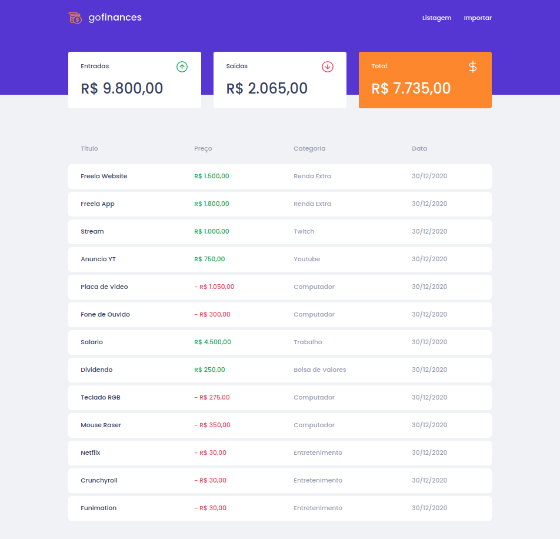
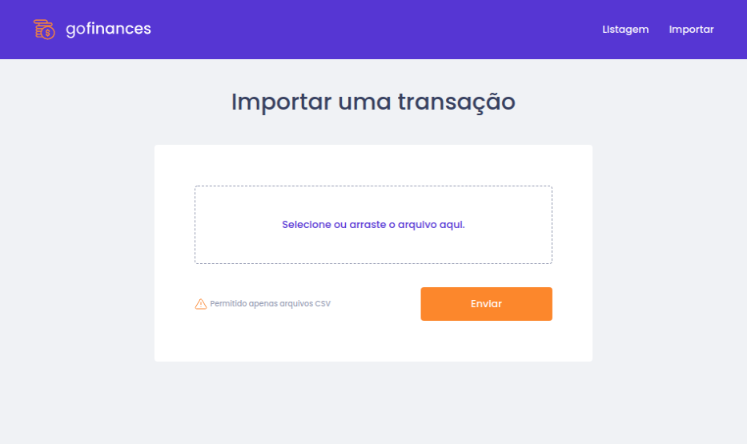
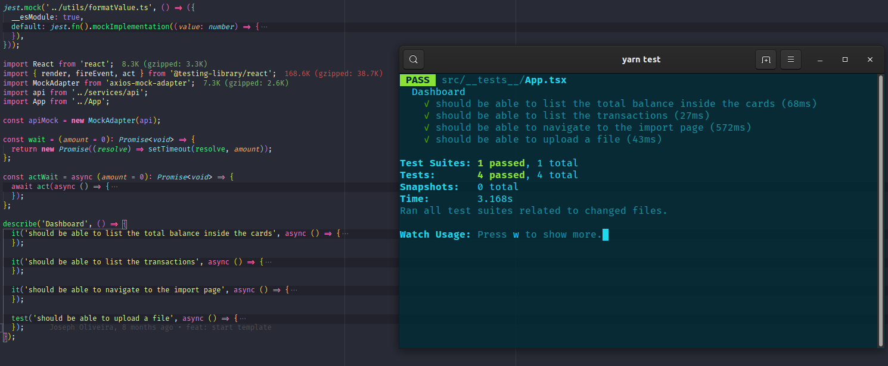

<h2 >
  Desafio 07: GoFinances Web 
</h2>

# Sobre o projeto

Aplicação web para listagem de gastos e receitas.

## 🧭 Como rodar o projeto?

### Pré-requisito

Para rodar a aplicação web, é necessário ter o backend rodando e servindo os dados. O projeto do backend está no no seguinte repositório do github: [Go Finances Backend](https://github.com/vitorsemidio-dev/gostack-challenge-06)

### Rodando a aplicação web

Após clonar o projeto e já está dentro da pasta e com o banco de dados rodando, utilize os seguintes comandos:

```bash
# Instale as dependências
$ npm install

# Execute o projeto
$ npm run start
```

## Fotos da aplicação

### Listagem

Tela em que é listada a tabela com as informações de entrada e saída, e fazendo o balanceamento dos gastos dividindo-os em **Entradas**, **Saídas** e **Total**;



### Importar

Tela onde é possível importar arquivos `.csv` e enviar ao backend.



## Testes

Com a aplicação rodando, para iniciar os testes utilize o comando `npm run test`;


